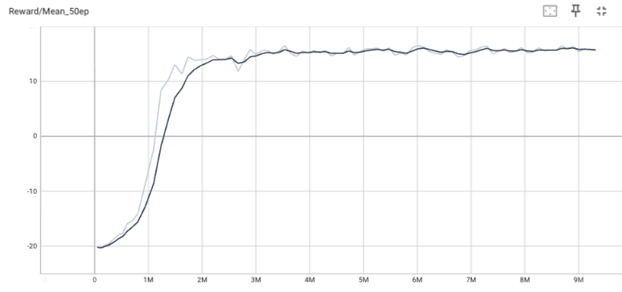
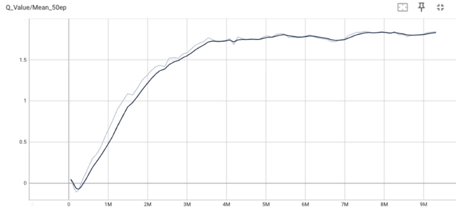
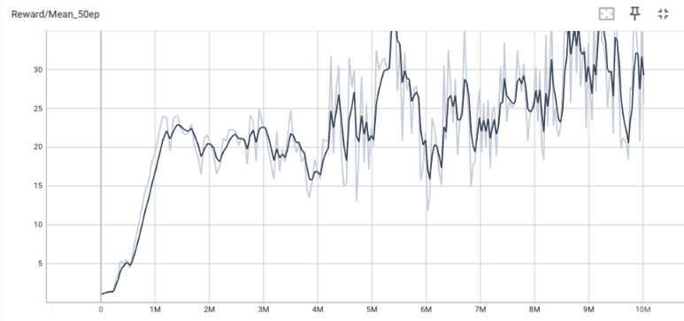
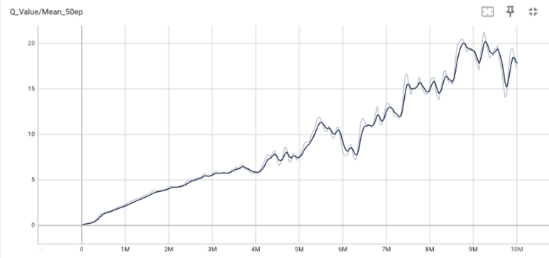

# Deep Q-Network (DQN) for Atari Games
This repository contains a PyTorch implementation of the **Deep Q-Network (DQN)** algorithm, as described in the DeepMind paper [*"Playing Atari with Deep Reinforcement Learning"*](https://arxiv.org/pdf/1312.5602) (Mnih et al., 2013).
The agent is trained to play Atari 2600 games (Pong, Breakout, etc.) directly from raw pixels using the Gymnasium environment.

# 📊 Results
**Models were evaluated over 30 episodes with an $\epsilon$-greedy policy ($\epsilon=0.05$).**

| Game Environment | Mean Score | Max Score | Observations |
| :--- | :---: | :---: | :--- |
| **🏓 Pong** (`ALE/Pong-v5`) | **18.93** $\pm$ 1.77 | **21.0** | Agent achieves near-perfect performance, close to the original paper. |
| **🧱 Breakout** (`ALE/Breakout-v5`) | **38.20** $\pm$ 65.35 | **277.0** | High scores achieved, variance remains high due to game difficulty. |

## 📈 Training Curves

Training was performed over 10 million frames. Below are the evolution curves of the Mean Reward and Mean Q-Value every 50 episodes.

### 🏓 Pong (`ALE/Pong-v5`)
The training on Pong shows a perfect convergence around 15-16 mean reward over 50 episodes.

| Mean Reward (50 ep) | Mean Q-Value (50 ep) |
| :---: | :---: |
|  |  |

**Analysis:**
* **Fast Convergence:** The agent solves the environment quickly (around 1-2M steps).
* **Stability:** Both the reward and Q-value curves plateau and remain stable, indicating a robust policy. The agent consistently predicts the value of its states.

### 🧱 Breakout (`ALE/Breakout-v5`)
Breakout is a more complex environment, resulting in different learning dynamics with a scattered evolution. The curve suggests that the agent continues to learn even after 10M steps. We still end up with an average reward of 35-40 over 50 episodes.

| Mean Reward (50 ep) | Mean Q-Value (50 ep) |
| :---: | :---: |
|  |  |

**Analysis:**
* **Continuous Learning:** Unlike Pong, the Q-values (right) continue to rise linearly even after 5M steps. This suggests the agent is constantly discovering new high-value states (e.g., digging a tunnel through the wall).
* **High Variance:** The reward curve (left) is noisy. This is typical for Breakout: a slight deviation in the paddle's position can mean the difference between clearing the level (high reward) or losing a life immediately (low reward).


# 🛠️ Installation

Install the dependencies:
```bash
uv sync
```

You can also create a virtual environment (venv) and install the dependencies listed in the `requirements.txt` file. Then, replace all the `uv run` commands with `python`.

# 🚀 Usage 
### Training

To train the agent, run train.py. You can modify hyperparameters in config.py.

```bash
uv run train.py
```


Checkpoints are saved automatically in the ```checkpoints/``` folder and TensorBoard logs in ```runs/``` folder.

### Evaluation

To evaluate a trained model, use ```eval.py```.

Basic evaluation (default 30 episodes, stats only):
```bash
uv run eval.py --path checkpoints/ALE/Breakout-v5_dqn_latest.pth --episodes 30
```


Watch the agent play (Render mode):
```bash
uv run eval.py --render
```

Record a video of the agent:
```bash
uv run eval.py --record
```

# 📂 Project Structure
- `train.py`: Main training loop (environment setup, experience collection, optimization).
- `dqn.py`: The CNN architecture and the DQNAgent class handling action selection and memory management.
- `utils.py`: Contains the ReplayMemory implementation and init_env util.
- `config.py`: Hyperparameters configuration (Learning rate, Batch size, Gamma, etc.).
- `eval.py`: Script for testing models and generating metrics/videos.

# ⚙️ Architecture & Hyperparameters
The implementation follows the classic nature of the DQN paper:
- **Preprocessing**: Grayscale, resized to 84x84, stacked 4 frames.
- **Network**: 2 Convolutional layers followed by 2 Fully Connected layers.
- **Optimization**: RMSProp optimizer.
- **Loss**: Smooth L1 Loss (Huber Loss).
- **Exploration**: Linear decay of $\epsilon$ from 1.0 to 0.1 over 1M training steps.

# 📜 References
Mnih, V., Kavukcuoglu, K., Silver, D., et al. (2013). [Playing Atari with Deep Reinforcement Learning](https://arxiv.org/pdf/1312.5602).
